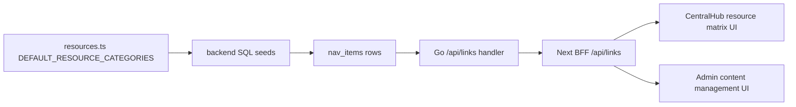

# Resource Matrix Data Contract

本文档定义资源矩阵数据在前端 mock、后端数据库种子、API 响应之间的固定映射关系。

## Source Of Truth

资源矩阵的内容源头是：

- `frontend/apps/web/src/data/resources.ts`
- `DEFAULT_RESOURCE_CATEGORIES`

后端数据库种子必须从这份前端结构同步而来。不要在后端 SQL 里独立发明资源矩阵内容。

当前需要保持同步的后端种子文件：

- `backend/db/migrate/migrations/003_seed_core_data.up.sql`
- `backend/db/init.sql`

## Category Mapping

| Frontend category id | Frontend label | Frontend icon | Backend `content_type` | Backend `sub_type` | API `module` | API `resource_sub_module` |
| --- | --- | --- | --- | --- | --- | --- |
| `intelligence` | 智库 | `Brain` | `resource_matrix` | `think_tank` | `resource_matrix` | `think_tank` |
| `surface` | 校园 | `MapPin` | `resource_matrix` | `campus` | `resource_matrix` | `campus` |
| `armory` | 工具 | `Wrench` | `resource_matrix` | `tools` | `resource_matrix` | `tools` |

## Field Mapping

| Frontend `resources.ts` | Backend `nav_items` | API response | Rule |
| --- | --- | --- | --- |
| `category.icon` | `icon` | `icon` | Use the category icon for every link in that category. |
| `category.links[index].title` | `title` | `title` | Preserve text exactly. |
| `category.links[index].desc` | `description` | `description` | Preserve text exactly. |
| `category.links[index].desc` | `content` | not required by UI | Keep equal to `description` for seed consistency. |
| `category.links[index].url` | `link_url` | `url`, `link_url` | API returns both names for frontend compatibility. |
| `category.links[index].tag` | not persisted | derived in frontend | Tags stay frontend-only for now. |
| link array position | `sort` | `sort` | `sort = index + 1`. |
| fixed | `content_type` | `module` | Always `resource_matrix`. |
| fixed | `category` | `category` | Always `resource_matrix`. |
| fixed | `active` | `active` | Always `1` for seeded visible links. |
| fixed | `cover_url` | `cover_url` | Empty string unless the frontend contract adds covers. |

## Runtime Data Flow



Frontend request examples:

```text
GET /api/links?module=resource_matrix&resource_sub_module=think_tank
GET /api/links?module=resource_matrix&resource_sub_module=campus
GET /api/links?module=resource_matrix&resource_sub_module=tools
```

Expected API envelope:

```json
{
  "links": [
    {
      "id": 1,
      "title": "CS 自学路线图",
      "description": "完整计算机科学自学路径",
      "url": "https://roadmap.sh/computer-science",
      "link_url": "https://roadmap.sh/computer-science",
      "module": "resource_matrix",
      "resource_sub_module": "think_tank",
      "sort": 1,
      "active": 1
    }
  ]
}
```

## Update Procedure

1. Edit `frontend/apps/web/src/data/resources.ts`.
2. Mirror the resource matrix rows in both backend SQL seed files.
3. Run:

```bash
cd frontend/apps/web
npm run check:resource-seeds
```

4. Re-inject local development data when needed:

```sql
DELETE FROM nav_items WHERE content_type = 'resource_matrix';
-- then insert the resource_matrix rows from backend/db/migrate/migrations/003_seed_core_data.up.sql
```

5. Verify the three API scopes return the same counts and order as `resources.ts`.

## Enforcement

The repository includes a contract check:

```bash
cd frontend/apps/web
npm run check:resource-seeds
```

This script parses `resources.ts` and both SQL seed files. It fails if any seeded `resource_matrix` row differs in `sub_type`, `icon`, `title`, `description`, `content`, `sort`, `active`, `category`, `cover_url`, or `link_url`.

This check should be run before deploying any resource matrix content change.
